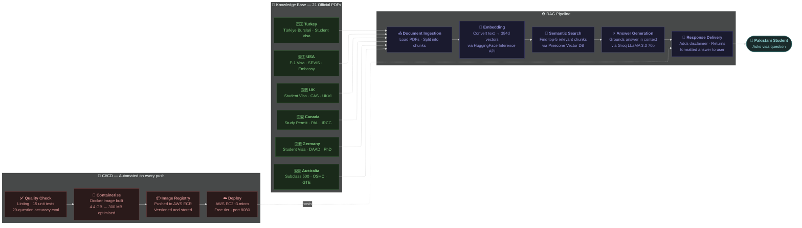

# TakeoffPK — AI-Powered Student Visa Guide for Pakistanis

> Helping Pakistani students navigate the complex world of international student visas using Retrieval-Augmented Generation (RAG) and Large Language Models.

**Live Demo:** http://13.235.238.227:8080

---

##Overview

TakeoffPK is an end-to-end AI chatbot built to solve a real problem — thousands of Pakistani students every year struggle to find accurate, up-to-date visa information for studying abroad. Most rely on outdated blogs or expensive consultants.

This project uses RAG architecture to ground AI responses in official government documents, achieving **96-100% accuracy** on a custom 29-question evaluation suite across 7 countries.

---

## Countries Covered

| Country | Visa Types Covered |
|---------|-------------------|
| 🇺🇸 USA | F-1 Student Visa (UG, Masters, PhD) |
| 🇬🇧 UK | Student Visa — CAS, Tier 4 (UG, PG, PhD) |
| 🇨🇦 Canada | Study Permit — PAL, SDS updates (UG, Masters, PhD) |
| 🇩🇪 Germany | Student Visa, PhD Visa, EU Blue Card, DAAD |
| 🇦🇺 Australia | Student Visa Subclass 500 (UG, PG, PhD) |
| 🇹🇷 Turkey | Student Visa, Türkiye Burslari Scholarship |

---

## Architecture
## 🏗️ Architecture


## Tech Stack

| Layer | Technology |
|-------|-----------|
| **LLM** | Groq — llama-3.3-70b-versatile (free tier) |
| **Embeddings** | HuggingFace Inference API — all-MiniLM-L6-v2 (free) |
| **Vector Database** | Pinecone Serverless (free starter) |
| **Backend** | Python, Flask |
| **Frontend** | HTML, CSS, JavaScript |
| **Containerization** | Docker |
| **Registry** | AWS ECR |
| **Deployment** | AWS EC2 t3.micro (free tier) |
| **CI/CD** | GitHub Actions — lint, test, build, deploy |
| **Testing** | pytest (15 unit tests), custom batch evaluation (29 questions) |
| **Linting** | flake8 |

---

## Evaluation Results

A custom batch test was built to evaluate accuracy across all countries:

| Country | Questions | Passed | Accuracy |
|---------|-----------|--------|----------|
| 🇬🇧 UK | 5 | 5 | 100% |
| 🇨🇦 Canada | 5 | 5 | 100% |
| 🇩🇪 Germany | 4 | 4 | 100% |
| 🇦🇺 Australia | 4 | 4 | 100% |
| 🇺🇸 USA | 5 | 5 | 100% |
| 🇹🇷 Turkey | 2 | 2 | 100% |
| Cross-Country | 2 | 2 | 100% |
| **Total** | **29** | **29** | **100%** |

---

##Project Structure

```
TakeoffPK/
├── src/
│   ├── __init__.py
│   ├── helper.py          ← PDF loading, text splitting, embeddings
│   └── prompt.py          ← System prompt for the LLM
├── Data/                  ← Official PDFs (not committed to GitHub)
│   ├── usa/               ← 4 PDFs (US Embassy, State Dept)
│   ├── uk/                ← 4 PDFs (UKVI official)
│   ├── canada/            ← 3 PDFs (IRCC official)
│   ├── germany/           ← 4 PDFs (German Embassy, DAAD)
│   ├── australia/         ← 3 PDFs (HomeAffairs official)
│   └── turkey/            ← 3 PDFs (Turkish Embassy Pakistan)
├── templates/
│   └── chat.html          ← Frontend UI
├── tests/
│   └── test_app.py        ← 15 unit tests (pytest)
├── app.py                 ← Flask application
├── store_index.py         ← PDF ingestion pipeline
├── batch_test.py          ← 29-question accuracy evaluation
├── requirements.txt       ← Development dependencies
├── requirements-prod.txt  ← Production dependencies (slim)
├── Dockerfile
├── .dockerignore
├── .env.example
├── .gitignore
└── .github/
    └── workflows/
        └── main.yaml      ← CI/CD pipeline
```

---

##CI/CD Pipeline

Every push to `main` automatically triggers:

```
Push to GitHub
      │
      ▼
① Continuous Integration (GitHub-hosted runner)
      ├── flake8 linting (syntax + style checks)
      └── pytest (15 unit tests)
      │
      ▼
② Build & Push (GitHub-hosted runner)
      ├── Docker build
      └── Push to AWS ECR
      │
      ▼
③ Deploy (Self-hosted runner on EC2)
      ├── Pull latest image from ECR
      ├── Stop old container
      ├── Start new container
      └── Cleanup old images
```

---

##How to Run Locally

### Prerequisites
- Python 3.10
- Conda or virtualenv
- Free API keys (Pinecone, Groq, HuggingFace)

### Step 1 — Clone the repo
```bash
git clone https://github.com/slaiba123/TakeoffPK.git
cd TakeoffPK
```

### Step 2 — Create environment
```bash
conda create -n TakeoffPK python=3.10 -y
conda activate TakeoffPK
pip install -r requirements.txt
```

### Step 3 — Configure environment variables
```bash
cp .env.example .env
# Edit .env with your actual API keys
```

```ini
PINECONE_API_KEY=your_pinecone_key
GROQ_API_KEY=your_groq_key
HUGGINGFACE_API_KEY=your_huggingface_token
```

Free API keys:
- **Pinecone**: https://pinecone.io
- **Groq**: https://groq.com
- **HuggingFace**: https://huggingface.co → Settings → Access Tokens

### Step 4 — Add official PDFs
Download PDFs from official embassy/government sources and place them in the correct `Data/` subfolder. See PDF Sources section below.

### Step 5 — Index documents
```bash
python store_index.py
```

### Step 6 — Run the app
```bash
python app.py
```
Open: http://localhost:8080

### Step 7 — Run tests
```bash
# Unit tests
pytest tests/ -v

# Accuracy evaluation (requires app running)
python batch_test.py
```

---

## AWS Deployment (Free Tier)

### Infrastructure
- **EC2**: t3.micro (1GB RAM, free tier eligible)
- **ECR**: Docker image registry (500MB free)
- **EBS**: 16GB storage
- **Estimated cost**: $0/month (within free tier limits)

### Deployment Steps

**1. Create IAM User**
```
AWS Console → IAM → Users → Create User
Attach: AmazonEC2FullAccess + AmazonEC2ContainerRegistryFullAccess
Generate Access Keys → save securely
```

**2. Create ECR Repository**
```
AWS Console → ECR → Create Repository → name: takeoffpk
```

**3. Launch EC2 Instance**
```
AMI: Ubuntu 22.04 LTS
Type: t3.micro
Security Group: open ports 22 (SSH) and 8080 (HTTP)
```

**4. Install Docker on EC2**
```bash
sudo apt-get update -y && sudo apt-get upgrade -y
curl -fsSL https://get.docker.com -o get-docker.sh
sudo sh get-docker.sh
sudo usermod -aG docker ubuntu
newgrp docker
```

**5. Configure Self-Hosted Runner**
```
GitHub repo → Settings → Actions → Runners → New self-hosted runner → Linux
Follow the commands shown on your EC2 instance
sudo ./svc.sh install && sudo ./svc.sh start
```

**6. Add GitHub Secrets**
```
AWS_ACCESS_KEY_ID
AWS_SECRET_ACCESS_KEY
AWS_REGION                = ap-south-1
AWS_ECR_LOGIN_URI         = <account_id>.dkr.ecr.ap-south-1.amazonaws.com
ECR_REPOSITORY_NAME       = takeoffpk
PINECONE_API_KEY
GROQ_API_KEY
HUGGINGFACE_API_KEY
```

**7. Deploy**
```bash
git push origin main
# GitHub Actions handles everything automatically
```

---

## PDF Sources

All data sourced from official government and embassy websites:

| Country | Source |
|---------|--------|
| 🇺🇸 USA | travel.state.gov, pk.usembassy.gov |
| 🇬🇧 UK | assets.publishing.service.gov.uk |
| 🇨🇦 Canada | ircc.canada.ca |
| 🇩🇪 Germany | germany.info, daad.de |
| 🇦🇺 Australia | immi.homeaffairs.gov.au |
| 🇹🇷 Turkey | islamabad-emb.mfa.gov.tr |

---

## ⚠️ Disclaimer

This tool is for **informational purposes only**. Visa rules change frequently. Always verify information with the official embassy or consulate before making any application decisions. This project is not affiliated with any government body or embassy.

---

## Author

**Laiba Mushtaq** — Computer Engineering Student  
GitHub: [@slaiba123](https://github.com/slaiba123)

---
